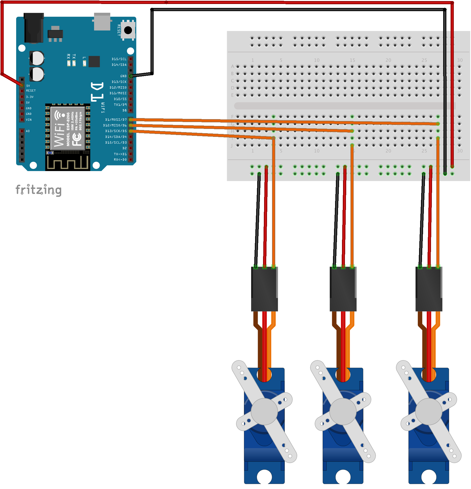
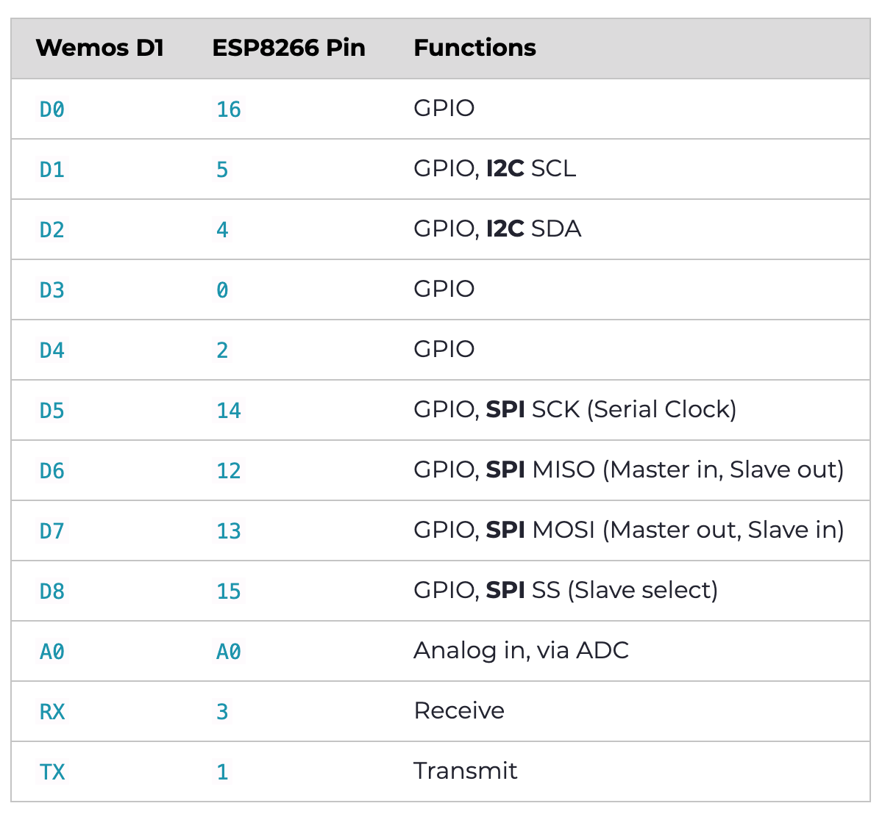
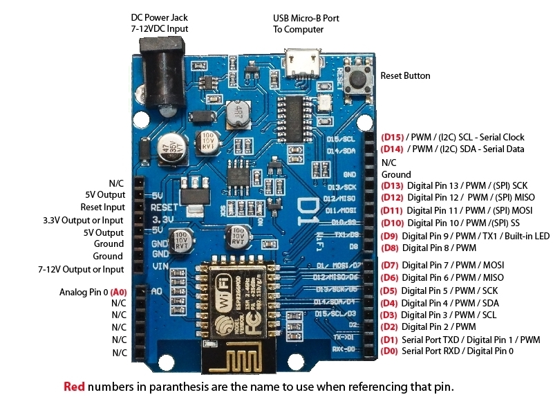

# Three Servos
This is a very basic example which will gather the most recent message and convey the three three variables (x, y and z) as motion using three servo motors.

## Components
* 1 x [WeMos D1 R2](https://hobbycomponents.com/development-boards/863-wemos-d1-r2-esp8266-development-board)
* 1 x [Breadboard](https://hobbycomponents.com/prototyping/118-breadboard-830-point-solderless-pcb-bread-board-mb-102-mb102-test-development-diy)
* 1 x [Pack of Jumper wires](https://hobbycomponents.com/cables/183-20cm-male-to-male-solderless-dupont-jumper-wires-40-cable-pack)
* 3 x [SG-90 Servos](https://hobbycomponents.com/motors-and-servos/130-sg90-micro-servo-9g)

## Prerequisites 
1. Install Arduino software - A tool to edit and upload code to Arduino compatible devices.
    * [Windows](https://www.arduino.cc/en/Guide/Windows)
    * [MacOS](https://www.arduino.cc/en/Guide/MacOSX)
    * [Linux](https://www.arduino.cc/en/Guide/Linux)
2. [Add the  CH340G drivers to your machine](https://learn.sparkfun.com/tutorials/how-to-install-ch340-drivers/all) - Software to support communication between your WeMos D1 and computer. 
3. [Add the Wemos library to the Arduino software](https://elementztechblog.wordpress.com/2016/10/14/programming-esp8266-wemos-d1-r2-using-arduino-ide/) - A library of code to make your code simpler.
4. [Add the ArduinoJSON library](https://arduinojson.org/v6/doc/installation/) - This is used to decode messages.

## Connecting Up
Wire up your components as below.

## Upload the Code
1. Open the Arduino Software
2. Copy the code from the `three-servos.ino` to the editor
3. Select the port your WeMos is connected to.
4. Select the board: `LOLIN(WEMOS) D1 R2 & mini`
5. Hit the upload
6. Open the serial monitor to see what it's doing
7. Post yourself a test message from [Sobots.xyz](http://sobots.xyz/)
8. Attach the servos to things and hack the code :)

## Things to Note
Pin numbers can be quite confusing. Boards like the D1 are weird hybrids where the base (mother) board is designed to emulate an Arduino Uno and on top their is an ESP8266 daughter board. The ESP8266 board is the one you are actually programming using Arduino's software and it has pins which are mapped to the Arduino board pins. So when you write code you need to use the ESP8266 pin numbers, but plug your wire into the WeMos pin number to which it is mapped!

Below are some images which can help, but also the libraries helpfully provide your code with some static variables to mask this complexity. So in your code you can us D1, D2... and A1.. as pin numbers and this will tell the code to which ESP8266 pin to use.

